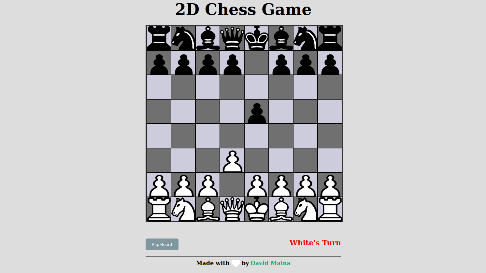

## JS 2D Chess Game

This is a complete well automated multi-player chess game implemented in HTML5, CSS, and JavaScript. 

_The game in action._

## Features

- Responsive design, compatible with different screen sizes
- Highlights piece valid moves on click
- Moves validations
- Animated display of checkmate and winner

## Installation

1. Clone the repository: `git clone https://github.com/davymaish/2d-chess-game.git`
2. Open the `index.html` file in your preferred web browser.

## How to Play

1. Open the game in your web browser.
2. Click a piece and valid moves would be highlighted
3. Select a square and the piece will move to that square
4. The game displays the winner when the king is checked.

## Contributing

Contributions are welcome! If you find any issues or have ideas for improvements, please open an issue or submit a pull request.

## License

This project is licensed under the [MIT License](LICENSE).

## Credits and Acknowledgements

The chess pieces images are downloaded from [Pixabay](https://pixabay.com/).

## Contact

For any inquiries or feedback, feel free to contact me via:

- Website: [davymaish.github.io](https://davymaish.github.io)
- Email: [davymaish6@gmail.com](mailto:davymaish6@gmail.com)
